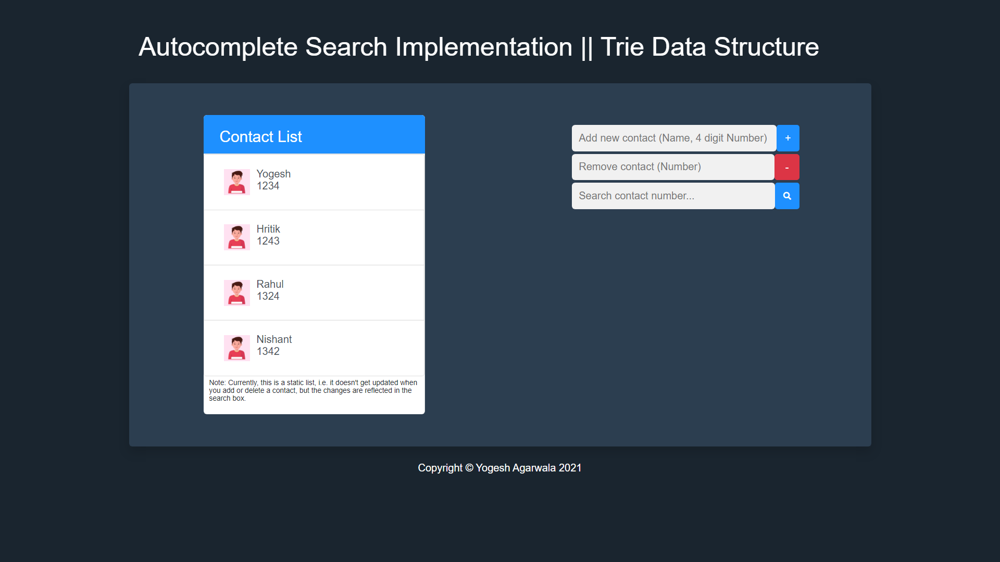

# Autocomplete Search - Tries Data Structure Implementation

- Autocomplete search feature using Trie data structure. 
- Wrote a Suffix Trie class having 3 methods - insert, delete and search a contact number. 
- Used DFS algo to traverse the trie & find all phone numbers which begins with the typed digits. 
- Displayed all matching numbers in real-time using javascript, as soon as the user starts to type
